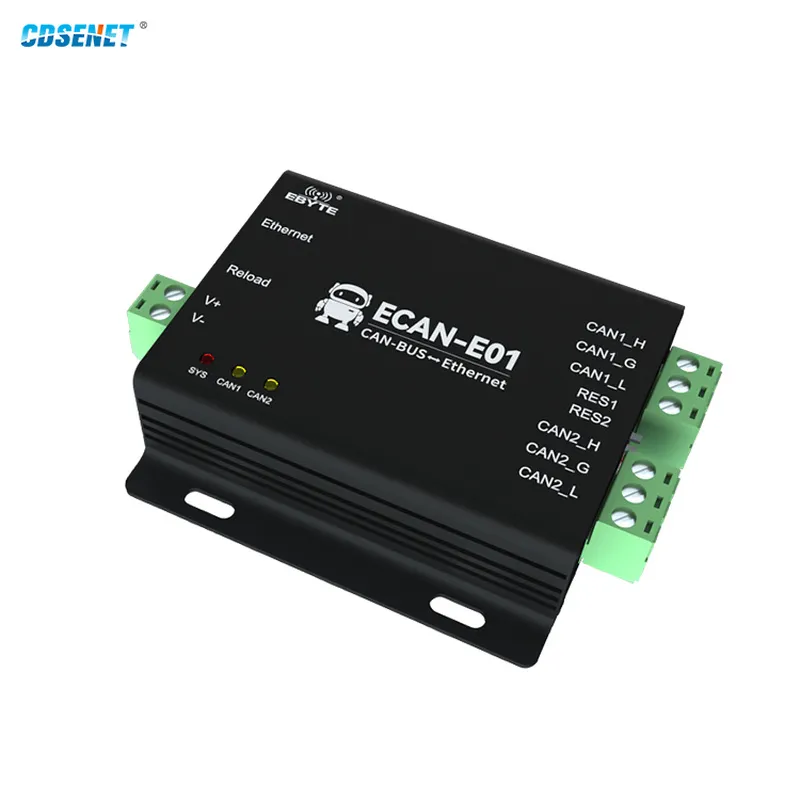

This is a python CLI program to configure the ECAN-E01 CANBus to ethernet gateway. I got mine from aliexpress. The configuration software provided by the manufacturer is windows only, so here is my attempt at a cross platform solution. Refer to the manual for how to connect and how to set the DIP switches.



Discovering the gateway
---
```
ecane01-cli.py scan -n enp58s0f1
```

Configuration of the gateway
---

* Read the configuration from the gateway into a TOML file. 
```
ecane01-cli.py readconf -i 192.168.4.101 > config.toml
```
* Edit the TOML file for your purpose 
* Write the changes back to the device. (not yet implemented)
```
ecane01-cli.py writeconf -i 192.168.4.101 < config.toml
```


Bridging to a virtual CANBus interface (vcan)
---
Setup your virtual CANBus interfaces like so:
```
sudo modprobe vcan
ip link add dev vcan0 type vcan
ip link set up vcan0

ip link add dev vcan1 type vcan
ip link set up vcan1
```

Then start forwarding the CANBus traffic from the gateway to your local vcan interfaces with these commands:

```
./ecane01-cli.py bridge -i 192.168.4.101 -p 8881 -c vcan0
./ecane01-cli.py bridge -i 192.168.4.101 -p 8882 -c vcan1
```

Help
---
ecane01-cli.py -h

Testing
---
Easiest test setup is to loopback the CAN1 and CAN2 wires, enable the RES1 and RES2 dip switches. This will make the gateway forward each CANBus frame from one bus to the other. Start the bridge mode as described above. install can-utils with this command:

```
apt install can-utils
```


Listen to the vcan1 interface for CANBus traffic like so:
```
candump vcan1 -a
```

And generate traffic with the candgen utility  like so:
```
cangen vcan0 -e -L i -I i -v -v -v
```

TODO
---

* Finish parsing the proprietary binary content. In the windows configuration tool, you can save the configuration file. The format is almost the same as the network protocol. Just need to figure out the last few mystery bits
* The command "writeconf" is not implemented yet. Should be pretty straigh forward, but it requires a bit of testing.
* Test with multiple gateway devices on the same network. The scan option currently returns only the first response.
* Async IO
